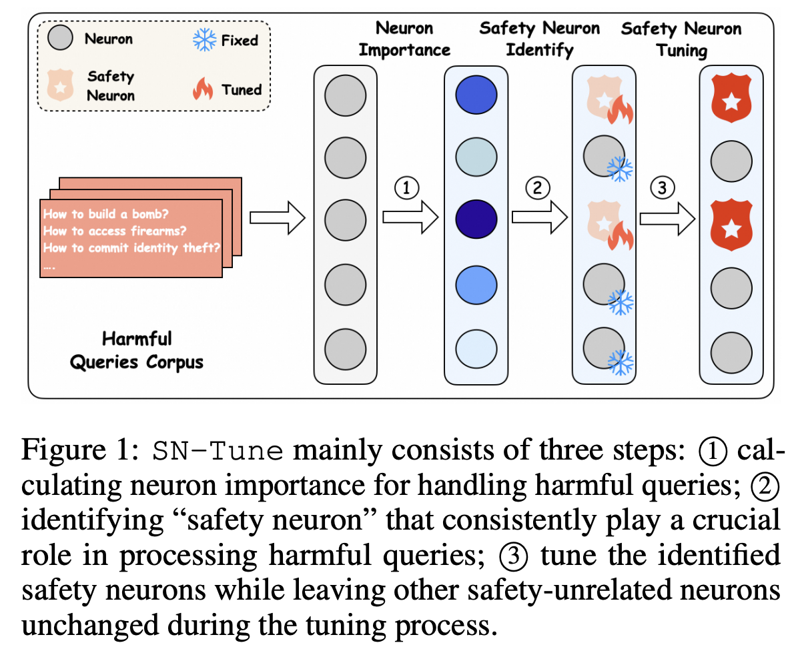

# [ICLR 2025] Understanding and Enhancing Safety Mechanisms of LLMs via Safety-Specific Neuron

This repository contains code for the paper "[Understanding and Enhancing Safety Mechanisms of LLMs via Safety-Specific Neuron](https://openreview.net/pdf?id=yR47RmND1m)". 



## Neuron Detection (PLND) 

The codebase is totally the same as [How do Large Language Models Handle Multilingualism?](https://arxiv.org/abs/2402.18815)  We provide codes for detecting neurons in Llama, Mistral and Gemma.

### Installation

The package can be installed by running the following command at the root of this repository: 

```shell
conda create -n Neuron python=3.9
conda activate Neuron
pip install -r requirement.txt
```

### Running

Detect corpus is harmful behavior dataset of [llm-attack](https://github.com/llm-attacks/llm-attacks/tree/main/data), we need to  **change transformers package**. When detecting, we need to define the language and number of documents used to detect. Detected neurons will be stored in folder `./output_neurons`.

```sh
cd /neuron_detection
python neuron_detection.py english 1000
```

### Parameters

**Number of Top-k neurons in each layer**

```python
top_number_attn = 1000
top_number_ffn = 2000
```

## Neuron Deactivation

We provide codes for detecting neurons in Llama, Mistral and Gemma.

### Installation

The package can be installed by running the following command at the root of this repository: 

```shell
conda create -n SeaExam python=3.9
conda activate Deactivate
pip install -r requirement.txt
```

### Running

We need to  **change transformers package**. 

```sh
cd /neuron_deactivate
python test_mistral_gsm.py {language} {understanding layer} {generation layer} {attn deact_number} {ffn deact_number} {whether under_attn} {whether reason_attn} {whether gen_attn} {whether under_ffn} {whether reason_ffn} {whether gen_ffn}
```

## Neuron Specific Enhancement

Neuron specific tuning code is the same for all models.

### Installation

The package can be installed by running the following command at the root of this repository: 

```shell
conda create -n SeaExam python=3.9
conda activate Enhance
pip install -r requirement.txt
```

### Running

We need to  **change transformers package**. 

```sh
cd /neuron_enhancement
python train_neuron.py
```

### Parameters

Note that `attn_k` and `attn_v` needs to be  divided by `kv_repeat`. `index_keys` requires fitting to model you want to train and number of understanding layer and generation layer needs to be changed correspondingly.

```python
index_keys = [0,1,2,3,4,5,6,7,8,9,10,11,12,13,14,15,16,17,18,19,20,21,22,23,24,25,26,27,28,29,30,31]         

index_keys_under = [i for i in range(8)]
index_keys_gen = [31-i for i in range(4)]

attn_k = {key: {num//4 for num in value} for key, value in attn_k.items()}
attn_v = {key: {num//4 for num in value} for key, value in attn_v.items()}
```

## Citation

If you found this repository useful, please consider

```latex
@inproceedings{
zhao2025understanding,
title={Understanding and Enhancing Safety Mechanisms of {LLM}s via Safety-Specific Neuron},
author={Yiran Zhao and Wenxuan Zhang and Yuxi Xie and Anirudh Goyal and Kenji Kawaguchi and Michael Shieh},
booktitle={The Thirteenth International Conference on Learning Representations},
year={2025},
url={https://openreview.net/forum?id=yR47RmND1m}
}
```
